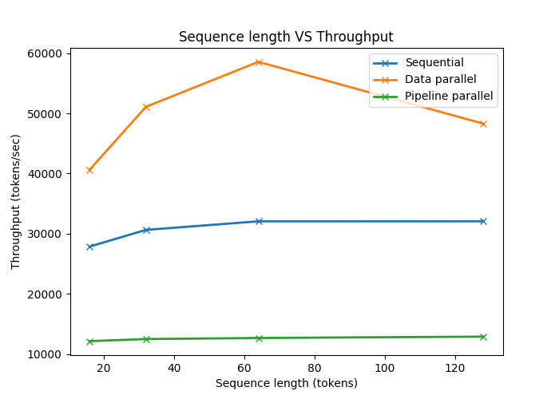

# Parallel-Training-Strategies-for-Toy-Transformers-Sequential-Data-and-Pipeline
PyTorch implementation of a toy Transformer model with sequential, data-parallel, and pipeline-parallel (1F1B) training. Includes experiments analyzing memory consumption and throughput trade-offs across different hyperparameters

This project explores training efficiency under different parallelism strategies:
- Sequential execution
- Data parallelism
- Pipeline parallelism (1F1B scheduling)

Results were measured on two NVIDIA GeForce RTX 2080 GPUs with a baseline model configuration with vocab_size = 1000, seq_len = 256, d_model = 512, n_heads = 8, n_layers = 12, ffn_mult = 4, dropout = 0.1, batch_size = 32.

## Results 
### Sequence length VS Throughput 

