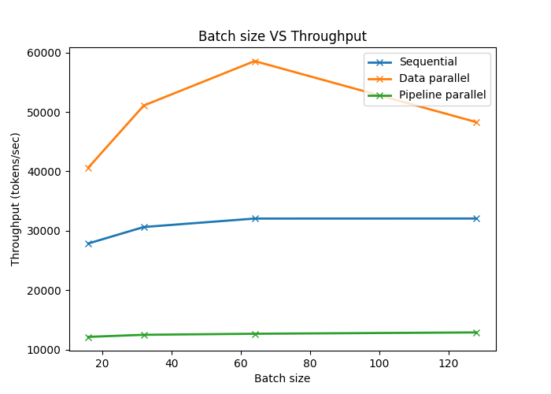
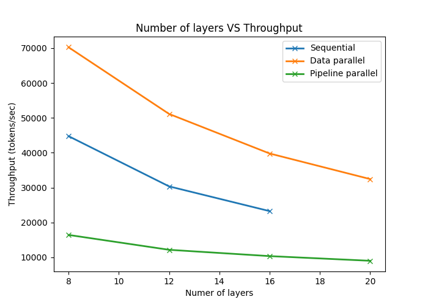

# Analysis Report: Parallel Training Strategies for Toy Transformers

## Overview
This report summarizes experiments on **Sequential execution**, **Data Parallelism**, and **Pipeline Parallelism** for a toy Transformer model implemented in PyTorch.  
**Throughput (tokens/sec)** and **GPU utilization (%)** were measured under varying:
- Batch size
- Sequence length
- Number of layers
- Micro-batch size (for pipeline parallelism)

Results were measured on two NVIDIA GeForce RTX 2080 GPUs with a baseline model configuration with vocab_size = 1000, seq_len = 256, d_model = 512, n_heads = 8, n_layers = 12, ffn_mult = 4, dropout = 0.1, batch_size = 32.

## 1. Batch size VS Throughput 

-**Observation**

## 2. Sequence length
### Sequence length VS Raw Throughput & Per GPU Throughput

## 3. Number of layers VS Throughput

## 4. Micro batch size VS Throughput (pipeline parallelism)
### Effect of Micro-batch Size
| Micro-batch size | GPU Utilization (%) | Avg Throughput (tokens/sec) | Max GPU memory (MB) |
|------------------|---------------------|-----------------------------|----------------------|
| 2 | [26.8, 16.2] | 12437.8 | [2929, 1797] |
| 4 | [26.2, 14.0] | 23390.3 | [2995, 1855] |
| 6 | [20.4, 11.6] | 31863.8 | [3035, 1881] |
| 8 | [25.2, 15.6] | 32207.5 | [3033, 1911] |
| 16 | [18.0, 14.8] | 33428.9 | [3243, 2007] |

## 5. Key Takeaways
- **Data parallelism** provides the best throughput and utilization across most scenarios.  
- **Pipeline parallelism** benefits from longer sequences and micro-batching, but suffers from communication overhead.  
- **Sequential execution** is simple but inefficient, limited by single GPU performance.  

---

## Next Steps
- Extend experiments to **hybrid parallelism** (data + pipeline).
- Explore **model parallelism** (tensor-slicing).
- Compare scaling behavior on larger models (beyond toy Transformers).
