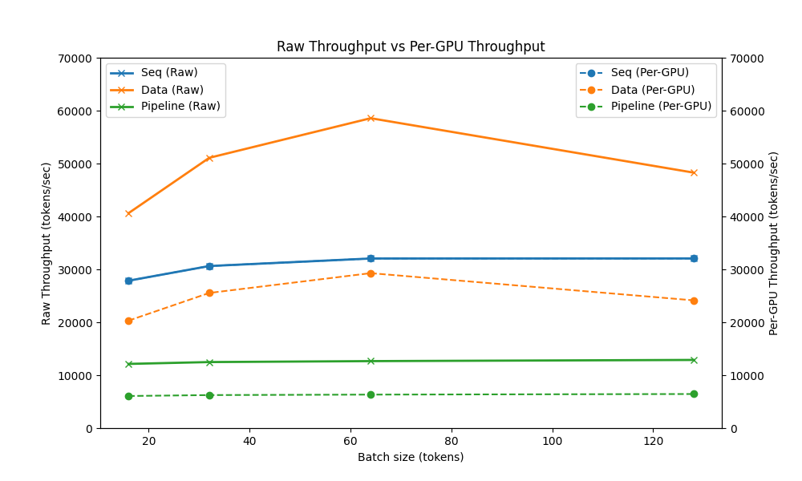
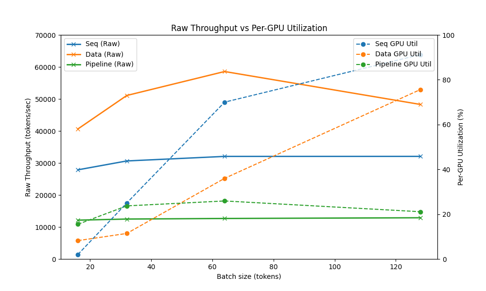
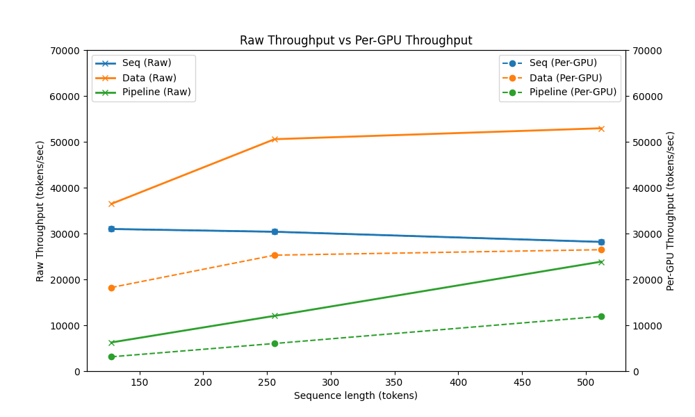
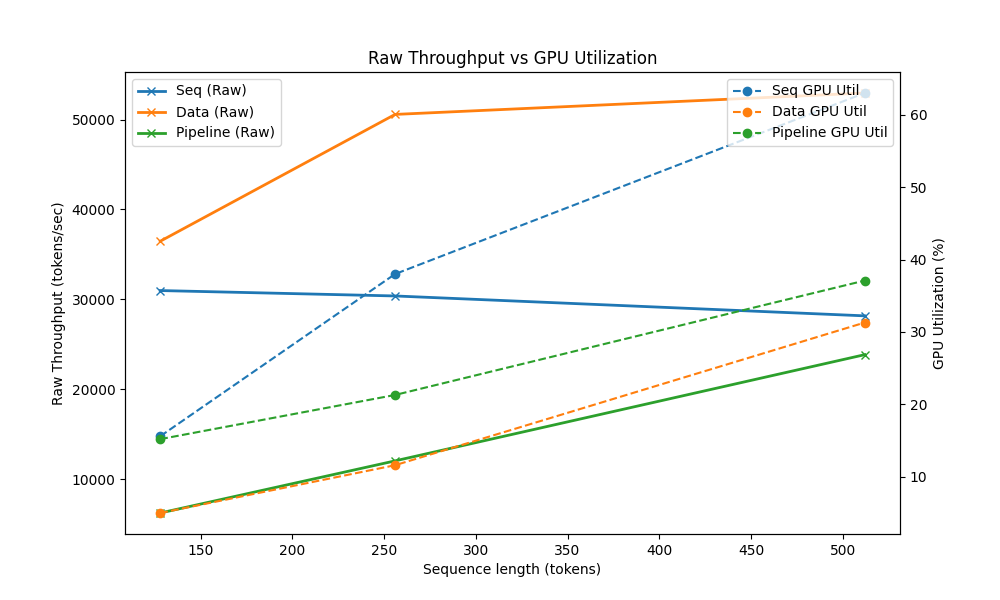
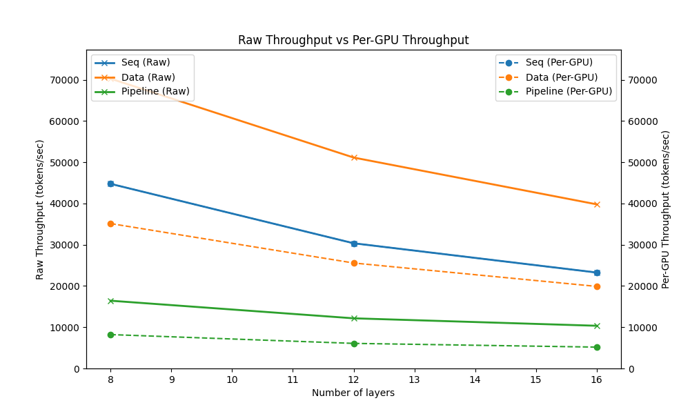
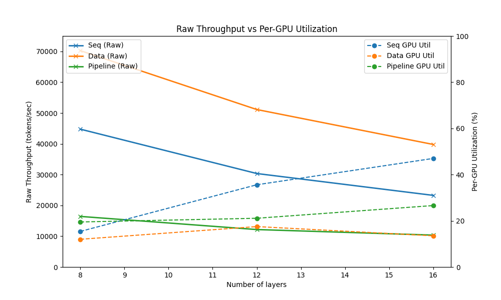
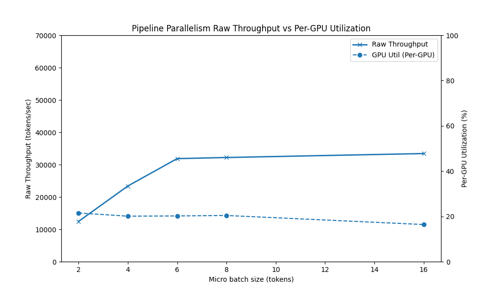

# Analysis Report: Parallel Training Strategies for Toy Transformers

## Overview
This report summarizes experiments on **Sequential execution**, **Data Parallelism**, and **Pipeline Parallelism** for a toy Transformer model implemented in PyTorch.  
**Throughput (tokens/sec)** and **GPU utilization (%)** were measured under varying:
- Batch size
- Sequence length
- Number of layers
- Micro-batch size (for pipeline parallelism)

Results were measured on two NVIDIA GeForce RTX 2080 GPUs with a baseline model configuration with vocab_size = 1000, seq_len = 256, d_model = 512, n_heads = 8, n_layers = 12, ffn_mult = 4, dropout = 0.1, batch_size = 32.

## 1. Batch size VS Throughput 

### Batch size VS Raw Throughput & Per GPU Throughput

### Batch size VS Raw Throughput & GPU Utilization

**Observation**
- Data parallelism consistently shows the highest raw throughput across all measured batch sizes. However, when normalized per GPU, its efficiency drops, highlighting a trade-off between maximizing total system throughput and ensuring per-device efficiency.
- Sequential execution achieves the highest per-GPU throughput and demonstrates significantly improved GPU utilization as the batch size increases. This suggests that sequential execution is more effective in maximizing resource usage when scaling batch size.
- While data parallelism is advantageous for maximizing total throughput, its lower per-GPU efficiency indicates that it may not be the optimal choice when GPU resources are limited or costly.
- Pipeline parallelism proves to be highly sensitive to micro-batch size tuning. Without proper tuning, it suffers from low GPU utilization due to bubble overhead. However, with the right configuration (e.g., larger sequence length or optimized micro-batching), pipeline parallelism can close this gap and become competitive.

## 2. Sequence length
### Sequence length VS Raw Throughput & Per GPU Throughput

### Sequence length VS Raw Throughput & GPU Utilization

**Observation**
- WHile sequential execution exhibits a decrease in the raw and per-GPU throughput, pipeline parallelism exhibits an increase across raw throughput, per-GPU throughput, and per-GPU utilization as the sequence length increase. This shows that pipeline parallelism is more beneficial for longer sequence lengths and that its performance could potentially overcome other training methods when longer sequence lengths are used. 

## 3. Number of layers VS Throughput

### Number of layers VS Raw Throughput & Per GPU Throughput

### Number of layers VS Raw Throughput & GPU Utilization

**Observation**
- Similar to the observation for varying sequence lengths, although the sequential execution shows the highest raw throughput, it also experiences the lowest GPU utilization for all ranges of the layer depths. 
- It's clear that not only does pipeline parallelism have the lowest throughput out of all three methods, but it also expreiences a gradual decreasing thhroughput as the number of layers increase. This trend suggests that memory pressure is a potential bottleneck for pipeline parallelism. Since each additional layer introduces its own trainable weights, activations, and intermediate states, even a small increase in the layer count imposes a significant memory load on the system. 

## 4. Micro batch size VS Throughput (pipeline parallelism)
### Effect of Micro-batch Size

| Micro-batch size | GPU Utilization (%) | Avg Throughput (tokens/sec) | Max GPU memory (MB) |
|------------------|---------------------|-----------------------------|----------------------|
| 2 | [26.8, 16.2] | 12437.8 | [2929, 1797] |
| 4 | [26.2, 14.0] | 23390.3 | [2995, 1855] |
| 6 | [20.4, 11.6] | 31863.8 | [3035, 1881] |
| 8 | [25.2, 15.6] | 32207.5 | [3033, 1911] |
| 16 | [18.0, 14.8] | 33428.9 | [3243, 2007] |

## 5. Key Takeaways
- All three methods of training present the same results:
    - Data parallelism presents the highest raw throughput, but the lowest per-GPU utilization across most cases.
    - Sequential execution presents the highest per-GPU utilization and per-GPU throughput. 
    - Pipeline parallelism benefits from longer sequences and micro-batching, but requires tuning and in order to out perform other methods of parallelism. 

---

## 6. Experimental Significance
Although most of these results align with well-known theoretical expectations, the experiments provide **empirical confirmation** of how parallelization strategies behave in practice on commodity GPUs (NVIDIA GeForce RTX 2080).  
By directly measuring throughput and utilization, this report bridges the gap between theory and practice, showing how textbook trade-offs manifest under realistic hardware and implementation constraints.

For example:
- At batch size = 64, data parallelism achieves ~2.5× higher raw throughput compared to sequential execution, but only ~0.6× per-GPU efficiency.  
- With 16 micro-batches in pipeline parallelism, throughput improves by ~2.7× compared to 2 micro-batches, highlighting the impact of bubble overhead mitigation.  

These quantitative results demonstrate that parallelization efficiency depends heavily on both workload configuration and tuning choices.

---

## 7. Limitations
- **Scale of hardware**: Experiments were limited to 2 NVIDIA RTX 2080 GPUs, which does not reflect large-scale training environments (e.g., 8–64 GPUs or A100/H100 clusters).  
- **Parallelism scope**: Only sequential, data parallelism, and pipeline parallelism were tested. Tensor parallelism and hybrid strategies were not explored.  
- **Model size**: The Transformer configuration was inevitably small (d_model=512, n_layers=12) for tractability, which may not fully capture scaling behavior of large language models.  
- **Metrics**: Focused on throughput and utilization; communication overhead, latency, and energy efficiency were not profiled.

---

## 8. Future Work
To extend this analysis and gain more insight about real-life large-scale training:
- **Scaling studies**: Extend experiments to 8+ GPUs and more powerful hardware (A100/H100) to assess interconnect and communication bottlenecks.  
- **Hybrid parallelism**: Investigate combinations of data, tensor, and pipeline parallelism to better understand trade-offs.  
- **Larger models**: Repeat experiments with larger Transformer variants (e.g., d_model ≥ 2048, n_layers ≥ 48) to capture real-world training challenges.  
- **Profiling tools**: Incorporate tools such as NVIDIA Nsight Systems or PyTorch Profiler to analyze kernel-level inefficiencies and communication overhead.  
- **Mixed precision training**: Compare FP32 vs. FP16/BF16 to study the impact on throughput and utilization.  

---

