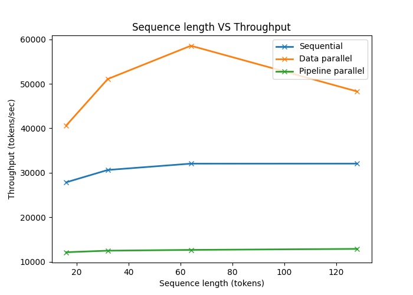

# Full analysis report

Results were measured on two NVIDIA GeForce RTX 2080 GPUs with a baseline model configuration with vocab_size = 1000, seq_len = 256, d_model = 512, n_heads = 8, n_layers = 12, ffn_mult = 4, dropout = 0.1, batch_size = 32.

### Batch size VS Throughput 

### Sequence length VS Throughput

### Number of layers VS Throughput

