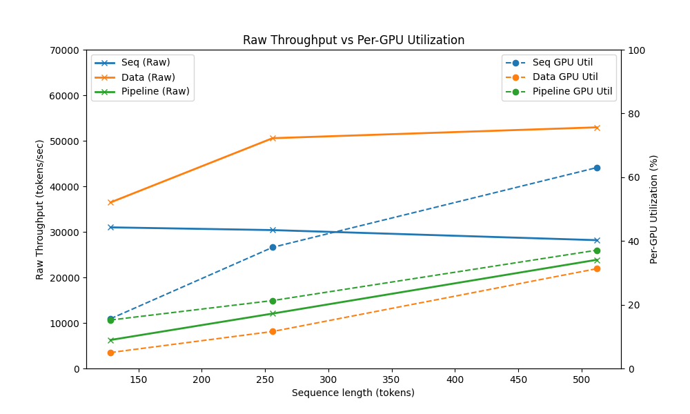

# Analysis Report: Parallel Training Strategies for Toy Transformers

## Overview
This report summarizes experiments on **Sequential execution**, **Data Parallelism**, and **Pipeline Parallelism** for a toy Transformer model implemented in PyTorch.  
**Throughput (tokens/sec)** and **GPU utilization (%)** were measured under varying:
- Batch size
- Sequence length
- Number of layers
- Micro-batch size (for pipeline parallelism)

Results were measured on two NVIDIA GeForce RTX 2080 GPUs with a baseline model configuration with vocab_size = 1000, seq_len = 256, d_model = 512, n_heads = 8, n_layers = 12, ffn_mult = 4, dropout = 0.1, batch_size = 32.

## 1. Batch size VS Throughput 

### Batch size VS Raw Throughput & Per GPU Throughput

### Batch size VS Raw Throughput & GPU Utilization

**Observation**
- Data parallelism consistently shows the highest raw throughput across all measured batch sizes. However, when normalized per GPU, its efficiency drops, highlighting a trade-off between maximizing total system throughput and ensuring per-device efficiency.
- Sequential execution achieves the highest per-GPU throughput and demonstrates significantly improved GPU utilization as the batch size increases. This suggests that sequential execution is more effective in maximizing resource usage when scaling batch size.
- While data parallelism is advantageous for maximizing total throughput, its lower per-GPU efficiency indicates that it may not be the optimal choice when GPU resources are limited or costly.
- Pipeline parallelism proves to be highly sensitive to micro-batch size tuning. Without proper tuning, it suffers from low GPU utilization due to bubble overhead. However, with the right configuration (e.g., larger sequence length or optimized micro-batching), pipeline parallelism can close this gap and become competitive.
- Overall, the results highlight that no single parallelism strategy dominates in all scenarios. Instead, the choice of strategy depends on the workload characteristics (batch size, sequence length, number of layers) and the optimization objective (total throughput vs. per-GPU efficiency).

## 2. Sequence length
### Sequence length VS Raw Throughput & Per GPU Throughput

### Sequence length VS Raw Throughput & GPU Utilization

## 3. Number of layers VS Throughput

### Number of layers VS Raw Throughput & Per GPU Throughput

### Number of layers VS Raw Throughput & GPU Utilization

## 4. Micro batch size VS Throughput (pipeline parallelism)
### Effect of Micro-batch Size

| Micro-batch size | GPU Utilization (%) | Avg Throughput (tokens/sec) | Max GPU memory (MB) |
|------------------|---------------------|-----------------------------|----------------------|
| 2 | [26.8, 16.2] | 12437.8 | [2929, 1797] |
| 4 | [26.2, 14.0] | 23390.3 | [2995, 1855] |
| 6 | [20.4, 11.6] | 31863.8 | [3035, 1881] |
| 8 | [25.2, 15.6] | 32207.5 | [3033, 1911] |
| 16 | [18.0, 14.8] | 33428.9 | [3243, 2007] |

## 5. Key Takeaways
- **Data parallelism** provides the best throughput and utilization across most scenarios.  
- **Pipeline parallelism** benefits from longer sequences and micro-batching, but suffers from communication overhead.  
- **Sequential execution** is simple but inefficient, limited by single GPU performance.  

---

## Next Steps
- Extend experiments to **hybrid parallelism** (data + pipeline).
- Explore **model parallelism** (tensor-slicing).
- Compare scaling behavior on larger models (beyond toy Transformers).
